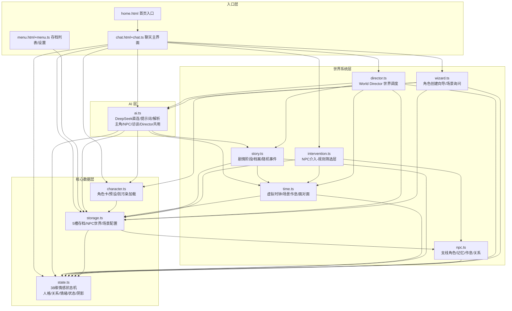
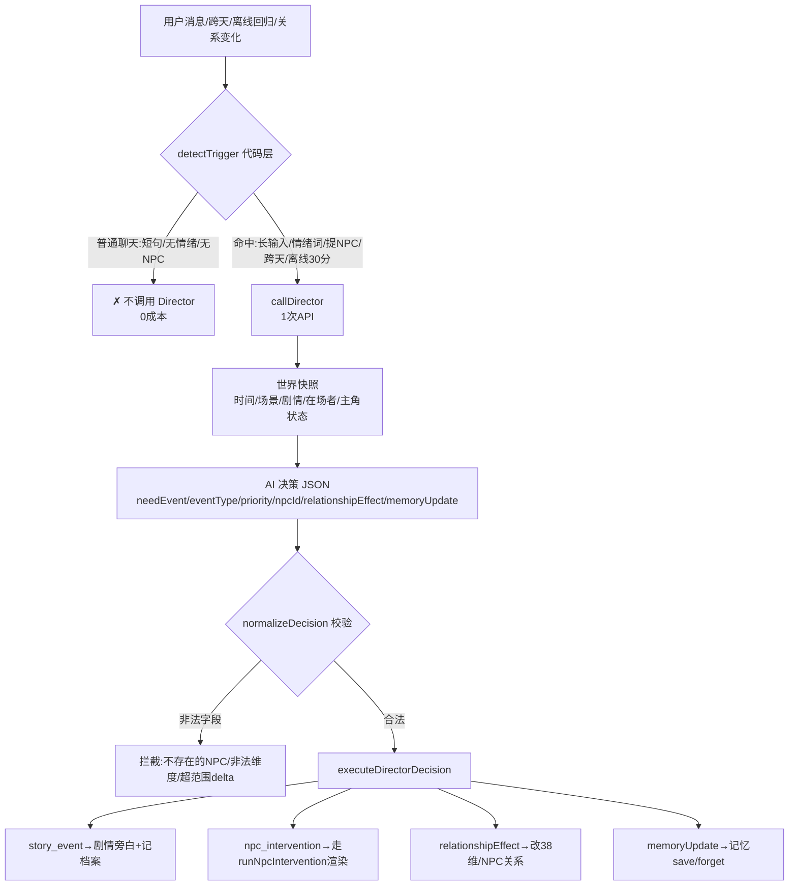
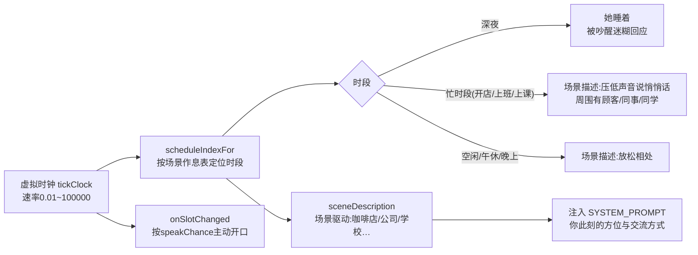

# 🧠 Melody AI 项目架构分析

## 一、项目概况

**定位**：纯前端 AI 数字人情感陪伴应用（PWA + Capacitor Android APK）
**规模**：12 个 TS 模块，共约 4400 行
**技术栈**：Vite 5 + TypeScript（esbuild 转换）+ 原生 DOM + DeepSeek API + localStorage 存档

## 二、模块架构图



## 三、核心设计：三层架构

| 层 | 职责 | 关键模块 |
|---|---|---|
| **界面层** | DOM 渲染、用户交互、打字机效果 | chat.ts / menu.ts |
| **世界系统层** | 时间/剧情/NPC/调度的"世界模拟" | time / story / npc / intervention / director |
| **数据层** | 38 维情感、存档、角色卡 | state / storage / character |

**AI 层是共用引擎**（ai.ts）——主角、NPC、角色访谈、World Director 四条调用链全部走它，只是提示词不同。

## 四、聊天主流程（用户发一条消息）

```mermaid
flowchart TD
    A[用户输入文本] --> B{sendMessage}
    B --> C[记录最后回复时间<br/>渲染用户消息+时间戳]
    C --> D{深夜?}
    D -- 是 --> D1[她睡着了→迷迷糊糊被吵醒<br/>prompt注入睡意]
    D -- 否 --> E[调 chatWithDeepSeek<br/>DeepSeek 直连]
    E --> F[SYSTEM_PROMPT 组装<br/>角色卡+38维数值+场景描述+在场者+记忆+档案]
    F --> G[AI 返回 JSON<br/>dialogue/delta/stats/memory/story]
    G --> H[parseAIResponse 容错解析<br/>提取{}块→dialogue兜底→重试]
    H --> I[applyDelta 应用情感变化<br/>+回归衰减]
    I --> J[写历史/记忆/剧情事件<br/>saveState 存档]
    J --> K[typeReply 打字机渲染]
    K --> L{主角回复完成}
    L --> M[maybeDirector<br/>代码层trigger判断]
    L --> N[maybeNpcIntervention<br/>规则筛选NPC介入]
```

## 五、World Director 世界调度（按需调用，非每轮）



## 六、NPC 动态介入（两层机制）

```mermaid
flowchart TD
    A[主角回复完成] --> B{多人模式开关<br/>store.npcEnabled}
    B -- 关(默认) --> X[✗ 不介入<br/>纯二人世界]
    B -- 开 --> C[第一层:screenNpcCandidates 规则筛选 0成本]
    C --> C1[已在场?跳过]
    C --> C2[深夜/睡着?跳过]
    C --> C3[6小时冷却?跳过]
    C --> C4[打分:提她+30/同场景+20/关系好+10/剧情相关+15/随机]
    C --> C5[私密话题?分数归零]
    C --> D[候选≥25分]
    D -- 无候选 --> X2[✗ 不介入]
    D -- 有候选 --> E[第二层:decideIntervention<br/>概率=min(55%, 20%+分数/100) 最多1个]
    E -- 未命中 --> X3[✗ 不介入]
    E -- 命中 --> F[runNpcIntervention]
    F --> F1[标记入场 presentNpcs]
    F --> F2[npcSpeak 独立上下文<br/>只给knownFacts+公开对话+场景]
    F --> F3[渲染NPC消息 蓝灰底+名字标签]
    F --> F4[写历史:主角不失忆]
    F --> F5[applyNpcResult<br/>情绪/记忆/关系/离场]
    F --> G[主角自然回应NPC<br/>消息90%/现场60%概率]
```

## 七、时间/场景驱动（面对面 + 作息）



## 八、数据流全景

```
角色创建向导(wizard)               聊天交互(chat)
    │ 询问场景+关系                     │
    ▼                                  ▼
角色卡(character) + 场景配置(storage.scene)
    │                                  │
    ▼                                  ▼
38维情感(state) ←── AI决策/对话delta ←── DeepSeek(ai)
    │                                  │
    ▼                                  ▼
存档(storage 5槽) ──→ 时间线(time) ──→ 剧情(story)
    │                                  │
    ▼                                  ▼
NPC世界(npc) ←── 规则筛选(intervention) ←── Director调度(director)
```

## 九、关键设计亮点

1. **回调注入解耦**：ai↔character、time↔character 用 `setCharacterGetter`/`setRelationGetter` 避免循环依赖
2. **成本控制**：Director 只按 trigger 调用（普通聊天 0 成本）；NPC 先规则筛选（0 成本）再概率决定
3. **信息边界**：NPC 只知道 `knownFacts`（显式告知/在场听到），prompt 注入 `presentContext` 收敛亲密话
4. **防污染**：角色加载以空模板为底，自定义创建不继承预设；关系驱动情感初始化（恋人≠陌生人）
5. **场景系统**：所有"学校"硬编码抽象为场景配置，创建角色时询问"在哪生活/她平时做什么"
